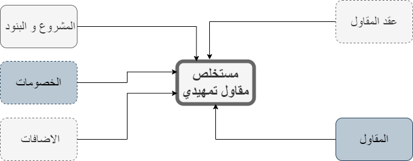

# 🏗️ مستخلصات المقاول التمهيدية

## مستخلص مقاول تمهيدي 

&#x20;هو تقدير وإعداد تقارير دورية توضح حجم الأعمال المنجزة والمستحقة للدفع من قبل المقاولين في مشروع البناء. تعد مستخلصات المقاولين التمهيدية أداة حاسمة لإدارة المشروع ومتابعة التقدم المالي للمقاولين. يتم استخدامها لتحديد المبالغ التي يجب دفعها للمقاولين بناءً على الأعمال التي تم تنفيذها وفقًا لعقد المشروع والمواصفات المحددة. تساعد مستخلصات المقاولين في ضمان الدفع المناسب للمقاولين وتحفزهم على القيام بأعمالهم بفعالية وفقًا للجدول الزمني والمواصفات المطلوبة. كما تسهم في توفير وسيلة لمراقبة التكاليف وتقدير تكلفة المشروع بشكل دقيق.



<figure><figcaption></figcaption></figure>



<figure><figcaption></figcaption></figure>

<figure><figcaption></figcaption></figure>



**يمكن انشاء مستخلص تمهيدي جديد عن طريق**  :                                                                                         &#x20;

1-انشاء المشروع و البنود                                                                                                               &#x20;

2-انشاء الخصومات و الاضافات                                                                                                     &#x20;

3- انشاء المقاولين                                                                                                                         &#x20;

4-انشاء العقود                                                                                                                                                                                                                                                                                                                                                 &#x20;

## الخصومات 

الخصومات في مستخلص المقاول:                                                                                                    &#x20;

&#x20;  مبالغ تقتطع أو تخصم من المستخلص الإجمالي للمقاول.                                                                &#x20;

تهدف إلى تصحيح المبالغ المستحقة وضمان دقة التقديرات المالية.                                             &#x20;

&#x20;تشمل:                                                                                                                                        &#x20;

الخصومات القانونية: رسوم تراخيص، ضرائب، رسوم تأمين.                                                          &#x20;

&#x20;الخصومات التقنية: عيوب أو أخطاء في الأعمال المنجزة.                                                             &#x20;

الخصومات التعاقدية: تأخير في التنفيذ أو عدم الامتثال للمواصفات.                                            &#x20;

الخصومات النقدية: تقتطع مباشرة بناءً على اتفاقات مالية محددة.                                               &#x20;

تتنوع الخصومات حسب طبيعة المشروع وشروط العقد.                                                               &#x20;

تهدف إلى تحقيق التوازن المالي وضمان تنفيذ الأعمال وفقًا للاتفاقات المالية والفنية.                                                                                                                                   &#x20;

## الاضافات  

الإضافات في مستخلص المقاول:                                                                                                   &#x20;

مبالغ تضاف إلى المستخلص الإجمالي للمقاول و تهدف إلى تعويض المقاول عن تكاليف إضافية أو أعمال غير متوقعة أو تحسينات أو تغييرات في المشروع.                                                                         &#x20;

تشمل:                                                                                                                                            &#x20;

الإضافات التقنية: أعمال إضافية أو تحسينات في المشروع غير مشمولة في العقد الأصلي.             &#x20;

التغييرات في النطاق: تعديلات في نطاق المشروع تتطلب إضافة أعمال إضافية.                             &#x20;

يوضح الرسم البيان التالي , دورة انشاء المستخلص                                                                       &#x20;

<figure><figcaption></figcaption></figure>

**المتطلبات الاولية لانشاء المستخلص هي:**                                                                                    &#x20;

[- المقاول](almqawlyn.md)                            [-المشروع  ](almshrwaat.md)              [-البنود](almshrwaat.md)                                                                                                                                                                                                                                                                                                                                     &#x20;

&#x20;**إنشاء  مستخلص تمهيدي:**                                                                                                                          &#x20;

يتم إنشاء مستخلص تمهيدي و اختيار المشروع و المقاول و البنود و في حالة إنشاء أول مستخلص   للمقاول مع المشروع يمكن كتابة نسب أو كميات سابقه و في حالة وجود عقد يتم اختيار العقد و يتم اختيار البنود الموجودة في العقد و امكانية تأكيد المستخلص و وجود موافقات                                                                                                  &#x20;

&#x20;**إنشاء مستخلص تمهيدي يحتوي على خصومات و إضافات:**                                                                            &#x20;

يمكن إنشاء المستخلص يحتوي على خصومات (قابلة للرد او ضريبة منبع او خاضع لضريبة القيمة المضافة)و يتم ظهور الخصومات التي تم اختيارها في شاشة المقاول                                          &#x20;

و يمكن أيضا إضافة مستخلصات تحتوي على إضافات (تقبل الخصم او ضريبة قيمة مضافة)        &#x20;

&#x20;      &#x20;

&#x20;**إنشاء مستخلص من مستخلص تمهيدي مؤكد:**                                                                                &#x20;

يمكن انشاء مستخلص مقاول عن طريق استيراد من مستخلص مقاول تمهيدي مؤكد .                      &#x20;

<figure><figcaption></figcaption></figure>

**موضح جدول ببيانات المستخلص التي يتم ادخالها**                                                                       &#x20;

<table><thead><tr><th width="173">اسماء البيانات</th><th width="85">النوع</th><th width="144">الحالة</th><th>الوصف</th></tr></thead><tbody><tr><td>كود المستخلص</td><td>رقم </td><td>غير مفعل </td><td>يتكون من مسلسل المشروع و مسلسل المقاول و مسلسل المستخلص</td></tr><tr><td>المجموعه</td><td>رقم</td><td>غير مفعل </td><td>يتم اظهار رقم المجموعه و يتم ربط الرقم بالمستخلصات التي تمت على نفس المشروع</td></tr><tr><td>الرقم</td><td>نص</td><td>مفعل</td><td>يتم كتابته يدويا </td></tr><tr><td>تاريخ المستخلص</td><td>تاريخ </td><td>مفعل</td><td>يتم كتابة تاريخ المستخلص و يتم انشاء القيد بنفس التاريخ الذي تم كتابته </td></tr><tr><td>المشروع</td><td>نص</td><td>مفعل</td><td></td></tr><tr><td>المقاول</td><td>نص</td><td>مفعل</td><td></td></tr><tr><td>تاريخ البدء</td><td>تاريخ </td><td>مفعل</td><td>يتم اظهار تاريخ بدء المشروع</td></tr><tr><td>تاريخ النهايه</td><td>تاريخ </td><td>مفعل</td><td>يتم اظهار تاريخ نهاية المشروع</td></tr><tr><td>العمله</td><td>نص</td><td>مفعل</td><td>في حالة ربط المقاول بعمله يتم اظهارها اتوماتيك</td></tr><tr><td>المعامل</td><td>رقم</td><td>غير مفعل </td><td>يتم اظهار معامله العمله عند تاريخ المستخلص</td></tr><tr><td>نسبه الضريبه</td><td>رقم</td><td>مفعل</td><td></td></tr><tr><td>قيمه الضريبه</td><td>رقم</td><td>غير مفعل </td><td></td></tr><tr><td>الوصف</td><td>نص</td><td>مفعل</td><td></td></tr></tbody></table>

&#x20;                                                      &#x20;

## &#x20;
