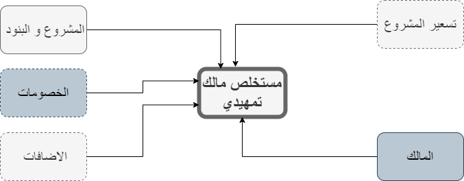

# 🏗️ مستخلصات المالك التمهيدية

## مستخلص مالك تمهيدي 

&#x20;

&#x20;هو تقدير وإعداد تقارير دورية توضح حجم الأعمال المنجزة والمستحقة للدفع من قبل المالكين في مشروع البناء. تعد مستخلصات المالكين التمهيدية أداة مهمة للمالكين لمراقبة تقدم المشروع والتأكد من تلبية المقاولين للمواصفات والمعايير المحددة في العقد. يتم استخدامها لتحديد المبالغ التي يجب دفعها للمقاولين بناءً على الأعمال التي تم تنفيذها وفقًا للمواصفات المطلوبة ومطابقتها للمعايير المحددة. بالإضافة إلى ذلك، تساهم مستخلصات المالكين في ضمان الدفع المناسب للمقاولين وتعزز الشفافية في عملية المحاسبة والتحصيل. تساعد هذه المستخلصات في توفير وسيلة للتحكم في التكاليف ومراقبة الميزانية العامة للمشروع بشكل فعال.

 



<figure><figcaption></figcaption></figure>




<figure><figcaption></figcaption></figure>

<figure><figcaption></figcaption></figure>



**يمكن انشاء مستخلص تمهيدي جديد عن طريق**  :                                                                                         &#x20;

1-انشاء المشروع و البنود                                                                                                               &#x20;

2-انشاء الخصومات و الاضافات                                                                                                     &#x20;

3- انشاء المالكين                                                                                                                         &#x20;

4-انشاء التسعير                                                                                                                                                                                                                                                                                                                                               &#x20;

## الخصومات 

الخصومات في مستخلص المالك هي مبالغ مستحقة يتم خصمها من المستخلص الإجمالي للمقاول  و تهدف إلى تعويض المالك عن عيوب أو تأخير أو عدم امتثال من قبل المقاول      للمواصفات أو الشروط المحددة في العقد                                                                                                                           &#x20;

تشمل:                                                                                                                              &#x20;

الخصومات الفنية: خصومات في حالة وجود عيوب فنية في الأعمال المنجزة أو عدم مطابقتها للمواصفات المحددة.                                                                                                            &#x20;

الخصومات التأخير: خصومات تعويضية في حالة تأخر المقاول في تنفيذ الأعمال وعدم استيفاء   المواعيد المحددة.                                                                                                                  &#x20;

الخصومات التعاقدية: خصومات محددة في العقد عند عدم الامتثال للشروط المحددة.          &#x20;

الخصومات القانونية: خصومات مفروضة بموجب القوانين والتشريعات في حالة عدم الامتثال    للمتطلبات القانونية أو اللوائح البيئية أو الصحية والسلامة.                                                    &#x20;

يختلف نوع وقيمة الخصومات حسب نوع المشروع وشروط العقد.                                          &#x20;

تهدف إلى حماية حقوق المالك وضمان التزام المقاول بالمواصفات والشروط المحددة وتعويض أي ضرر ناتج عن عدم الامتثال                                                                                                                                 &#x20;

## الاضافات  

الإضافات في مستخلص المالك هي  مبالغ تضاف إلى المستخلص الإجمالي للمقاول و تهدف إلى تعويض المقاول عن تكاليف إضافية أو تغييرات أو تحسينات في المشروع بناءً على طلب المالك                                                                                                                &#x20;

تشمل:                                                                                                                                          &#x20;

الإضافات التقنية: تنفيذ أعمال إضافية أو تحسينات في المشروع غير مشمولة في العقد الأصلي.

&#x20; التغييرات في النطاق: تعديل نطاق المشروع يستدعي إضافة أعمال إضافية للمقاول.                 &#x20;

الظروف الخاصة: ظروف غير متوقعة تتطلب إجراءات إضافية أو تكاليف أعلى.                           &#x20;

&#x20;الأداء الممتاز: تحفيز المقاول بإضافة مبالغ إضافية في حالة تحقيق أداء ممتاز أو تجاوز الأهداف   المحددة.

تتنوع الإضافات حسب طبيعة المشروع وشروط العقد.                                                                  &#x20;

&#x20;تهدف إلى تعويض المقاول عن الأعمال الإضافية والتكاليف غير المتوقعة وتحفيزه لتقديم أداء     متميز في المشروع.                                                                                                                      &#x20;

يوضح الرسم البيان التالي , دورة انشاء المستخلص                                                                       &#x20;

<figure><figcaption></figcaption></figure>

**المتطلبات الاولية لانشاء المستخلص هي:**                                                                                    &#x20;

[- الما](almqawlyn.md)لك                       [-المشروع  ](almshrwaat.md)                            [-البنود](almshrwaat.md)                                                                                                                                                                                                                                                                                                                                     &#x20;

&#x20;**إنشاء  مستخلص تمهيدي:**                                                                                                                          &#x20;

يتم إنشاء مستخلص تمهيدي و اختيار المشروع و المالك و البنود و في حالة إنشاء أول مستخلص   للمالك مع المشروع يمكن كتابة نسب أو كميات سابقه و في حالة وجود تسعير معتمد يتم  إظهار الكميات و الأسعار الموجودة في التسعير على مستوى البند و امكانية تأكيد المستخلص و وجود  موافقات.                                                                                                                                    &#x20;

&#x20;**إنشاء مستخلص تمهيدي يحتوي على خصومات و إضافات:**                                                                            &#x20;

يمكن إنشاء المستخلص يحتوي على خصومات (قابلة للرد او ضريبة منبع او خاضع لضريبة القيمة المضافة)و يتم ظهور الخصومات التي تم اختيارها في شاشة المالك                                          &#x20;

و يمكن أيضا إضافة مستخلصات تحتوي على إضافات (تقبل الخصم او ضريبة قيمة مضافة)        &#x20;

&#x20;      &#x20;

&#x20;**إنشاء مستخلص من مستخلص تمهيدي مؤكد:**                                                                                &#x20;

يمكن انشاء مستخلص مالك عن طريق استيراد من مستخلص مالك تمهيدي مؤكد .                      &#x20;

<figure><figcaption></figcaption></figure>

**موضح جدول ببيانات المستخلص التي يتم ادخالها**                                                                       &#x20;

<table><thead><tr><th width="187">اسماء البيانات</th><th width="97">النوع</th><th width="94">الحالة</th><th>الوصف</th></tr></thead><tbody><tr><td>المشروع</td><td>نص</td><td>مفعل </td><td></td></tr><tr><td>الرقم</td><td>نص</td><td>مفعل</td><td></td></tr><tr><td>تاريخ المستخلص</td><td>تاريخ </td><td>مفعل</td><td>يتم كتابة تاريخ المستخلص و يتم انشاء القيد بنفس التاريخ الذي تم كتابته</td></tr><tr><td>المشروع</td><td>نص</td><td>مفعل</td><td></td></tr><tr><td>المالك</td><td>نص</td><td>غير مفعل </td><td>يتم اختيار المالك بناءًا على المشروع المختار</td></tr><tr><td>تاريخ البدء</td><td>تاريخ </td><td>مفعل</td><td>يتم اظهار تاريخ بدء المشروع</td></tr><tr><td>تاريخ النهايه</td><td>تاريخ </td><td>مفعل</td><td>يتم اظهار تاريخ نهاية المشروع</td></tr><tr><td>العمله</td><td>نص</td><td>مفعل</td><td>في حالة ربط المالك بعمله يتم اظهارها اتوماتيك</td></tr><tr><td>المعامل</td><td>رقم</td><td>غير مفعل </td><td>يتم اظهار معامله العمله عند تاريخ المستخلص</td></tr><tr><td>نسبه الضريبه</td><td>رقم</td><td>مفعل</td><td></td></tr><tr><td>قيمه الضريبه</td><td>رقم</td><td>غير مفعل </td><td></td></tr><tr><td>الوصف</td><td>نص</td><td>مفعل</td><td></td></tr><tr><td>مندوب المبيعات</td><td>نص</td><td>مفعل</td><td></td></tr></tbody></table>

&#x20;                                                      &#x20;

## &#x20;
