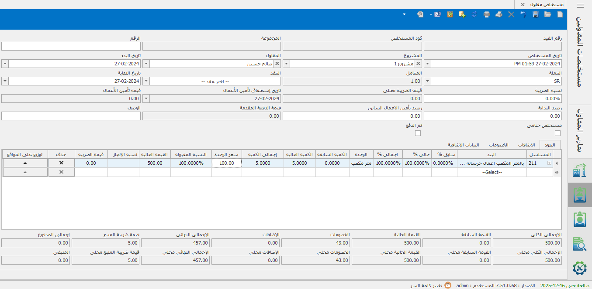
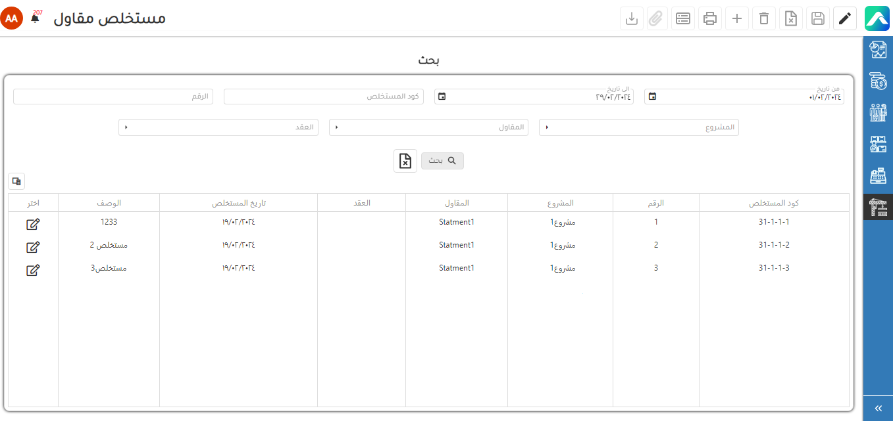

# 🏗️ مستخلصات المقاول

## مستخلص مقاول 

مستخلصات المقاولين هي مستندات مالية تظهر تقدم العمل والتكاليف الناتجة عن مشروع    المقاولة. تعد هذه المستخلصات أداة مهمة في محاسبة المقاولات، حيث تساعد في تقدير  الأعمال المنجزة وتحديد المدفوعات المستحقة للمقاول. تحتوي مستخلصات المقاولين على  معلومات مثل كميات الأعمال التي تم تنفيذها، والأسعار المتفق عليها، والمدفوعات المستحقة  والمدفوعات المستلمة. تعمل هذه المستخلصات على توفير رؤية شاملة للتقدم المالي للمشروع،  بما في ذلك: التكلفة الفعلية والمدفوعات المستحقة والمتأخرة. إضافة إلى ذلك، تساهم     مستخلصات المقاولين في توفير بيانات مالية دقيقة وشفافة للمقاول وأطراف العقد الأخرى، مما  يعزز التعاون والثقة فيمَا بينهم ويسهم في إدارة مشروع المقاولة بفعالية                                    &#x20;



<figure><figcaption></figcaption></figure>



<figure><figcaption></figcaption></figure>

<figure><figcaption></figcaption></figure>




**يمكن إنشاء مستخلص جديد عن طريق**  :                                                                                         &#x20;

1-إنشاء المشروع و البنود                                                                                                               &#x20;

2-إنشاء الخصومات و الإضافات                                                                                                     &#x20;

3- إنشاء المقاولين                                                                                                                         &#x20;

4-إنشاء العقود                                                                                                                              &#x20;

5-إنشاء مستخلصات تمهيديه                                                                                                        &#x20;

6-إنشاء مستخلص مقاول                                                                                                              &#x20;

## الخصومات 

الخصومات في مستخلص المقاول:                                                                                                    &#x20;

&#x20;  مبالغ تقتطع أو تخصم من المستخلص الإجمالي للمقاول.                                                                &#x20;

تهدف إلى تصحيح المبالغ المستحقة وضمان دِقَّة التقديرات المالية.                                             &#x20;

&#x20;تشمل:                                                                                                                                        &#x20;

الخصومات القانونية: رسوم تراخيص، ضرائب، رسوم تأمين.                                                          &#x20;

&#x20;الخصومات التقنية: عيوب أو أخطاء في الأعمال المنجزة.                                                             &#x20;

الخصومات التعاقدية: تأخير في التنفيذ أو عدم الامتثال للمواصفات.                                            &#x20;

الخصومات النقدية: مبالغ تقتطع بناءً على اتفاقات مالية محددة.                                               &#x20;

تتنوع الخصومات حسب طبيعة المشروع وشروط العقد.                                                               &#x20;

تهدف إلى تحقيق التوازن المالي وضمان تنفيذ الأعمال وفقًا للاتفاقات المالية والفنية.                                                                                                                                   &#x20;

## الإضافات  

الإضافات في مستخلص المقاول:                                                                                                   &#x20;

مبالغ تضاف إلى المستخلص الإجمالي للمقاول و تهدف إلى تعويض المقاول عن تكاليف إضافية أو أعمال غير متوقعة أو تحسينات أو تغييرات في المشروع.                                                                         &#x20;

تشمل:                                                                                                                                            &#x20;

الإضافات التقنية: أعمال إضافية أو تحسينات في المشروع غير مشمولة في العقد الأصلي.             &#x20;

التغييرات في النطاق: تعديلات في نطاق المشروع تتطلب إضافة أعمال إضافية.                             &#x20;

الظروف الخاصة: ظروف غير متوقعة تتطلب إجراءات إضافية أو تكاليف أعلى.                               &#x20;

الأداء الممتاز: مكافآت إضافية لأداء ممتاز أو تجاوز الأهداف المحددة.                                             &#x20;

تتنوع الإضافات حسب طبيعة المشروع وشروط العقد.                                                                   &#x20;

&#x20; تهدف إلى تعويض المقاول عن الأعمال الإضافية والتكاليف غير المتوقعة وتحفيزه لتقديم أداء                متميز في المشروع.

يوضح الرسم البيان التالي, دورة إنشاء المستخلص                                                                          &#x20;

<figure><figcaption></figcaption></figure>

**المتطلبات الأولية لإنشاء المستخلص هي:**                                                                                    &#x20;

[- المقاول](almqawlyn.md)                [-المشروع ](almshrwaat.md)                    [-البنود ](almshrwaat.md)                                                                             &#x20;

&#x20;**إنشاء أول مستخلص:**                                                                                                                          &#x20;

يتم إنشاء مستخلص جديد و اختيار المشروع و المقاول و البنود و في حالة إنشاء أول مستخلص   للمقاول مع المشروع يمكن كتابة نسب أو كميات سابقه و في حالة وجود عقد يتم اختيار العقد و يتم اختيار البنود الموجودة في العقد و يمكن إضافة رصيد بداية في أول مستخلص أو إضافة تأمين أعمال سابق.                                                                                                                             &#x20;

&#x20;**إنشاء مستخلص ختامي:**                                                                                                                      &#x20;

يتم إنشاء مستخلص ختامي عن طريق الضغط على اختيار ختامي و يتم رد تأمين الأعمال  إن وجد.

&#x20;**إنشاء مستخلص يحتوي على خصومات و إضافات:**                                                                            &#x20;

يمكن إنشاء المستخلص يحتوي على خصومات (قابلة للرد أو ضريبة منبع أو خاضع لضريبة القيمة المضافة)و يتم ظهور الخصومات التي تم اختيارها في شاشة المقاول                                          &#x20;

و يمكن أيضا إضافة مستخلصات تحتوي على إضافات (تقبل الخَصْم أو ضريبة قيمة مضافة)         &#x20;

<figure><figcaption></figcaption></figure>

**موضح جدول  خانات الإدخال الموجودة في شاشة المستخلص**                                                                       &#x20;

<table><thead><tr><th width="153">اسماء البيانات</th><th width="100">النوع</th><th width="117">الحالة</th><th>الوصف</th></tr></thead><tbody><tr><td>رقم القيد</td><td>رقم</td><td>غير مفعل </td><td>يتم اظهار رقم القيد الناتج بعد حفظ المستخلص</td></tr><tr><td>كود المستخلص</td><td>رقم </td><td>غير مفعل </td><td>يتكون من مسلسل المشروع و مسلسل المقاول و مسلسل المستخلص</td></tr><tr><td>المجموعه</td><td>رقم</td><td>غير مفعل </td><td>يتم اظهار رقم المجموعه و يتم ربط الرقم بالمستخلصات التي تمت على نفس المشروع</td></tr><tr><td>الرقم</td><td>رقم</td><td>مفعل</td><td>يتم كتابته يدويا </td></tr><tr><td>تاريخ المستخلص</td><td>تاريخ </td><td>مفعل</td><td>يتم كتابة تاريخ المستخلص و يتم انشاء القيد بنفس التاريخ الذي تم كتابته </td></tr><tr><td>المشروع</td><td>نص</td><td>مفعل</td><td></td></tr><tr><td>المقاول</td><td>نص</td><td>مفعل</td><td></td></tr><tr><td>تاريخ البدء</td><td>تاريخ </td><td>مفعل</td><td>يتم اظهار تاريخ بدء المشروع</td></tr><tr><td>تاريخ النهايه</td><td>تاريخ </td><td>مفعل</td><td>يتم اظهار تاريخ نهاية المشروع</td></tr><tr><td>العمله</td><td>نص</td><td>مفعل</td><td>في حالة ربط المقاول بعمله يتم اظهارها اتوماتيك </td></tr><tr><td>المعامل</td><td>رقم</td><td>غير مفعل </td><td>يتم اظهار معامله العمله عند تاريخ المستخلص </td></tr><tr><td>نسبه الضريبه</td><td>رقم</td><td>مفعل</td><td></td></tr><tr><td>قيمه الضريبه</td><td>رقم</td><td>غير مفعل </td><td></td></tr><tr><td>العقد</td><td>نص</td><td>مفعل</td><td></td></tr><tr><td>تاريخ استحقاق تأمين الاعمال </td><td>تاريخ </td><td>غير مفعل </td><td>عند عمل المستخلص ختامي يتم اظهار تاريخ استحقاق تأمين الاعمال </td></tr><tr><td>قيمة تأمين الاعمال </td><td>رقم</td><td>غير مفعل </td><td>عند عمل المستخلص ختامي يتم اظهار قيمة الخصومات القابلة للرد في قيمة تأمين الأعمال </td></tr><tr><td>رصيد البدايه</td><td>رقم</td><td>مفعل</td><td></td></tr><tr><td>رصيد تأمين الاعمال السابق </td><td>رقم</td><td>مفعل</td><td></td></tr><tr><td>قيمة الدفعه المقدمه </td><td>رقم</td><td>غير مفعل </td><td>يتم اظهار قيمة الدفعة المقدمة التي تم قبضها في عقد المقاول </td></tr><tr><td>الوصف</td><td>نص</td><td>مفعل</td><td></td></tr></tbody></table>

&#x20;  &#x20;

**المواضيع ذات الصلة**                                                                                                                         &#x20;

[**-عقد المقاول**](aqd-almqawl.md)                                                                                                                                    &#x20;

[**-مستخلص مقاول تمهيدي** ](mstkhlsat-almqawl-2.md)                                                                                                                 &#x20;

## &#x20;
