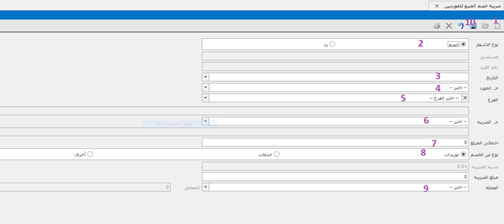

# ضرائب الخصم و الإضافة

## ضريبة خصم المنبع للموردين 

فتح إشعار جديد \
اختيار نوع الإشعار (خصم أو رد) \
كتابة تاريخ الإشعار \
اختيار حساب المورد الذى سوف يتم خصم الضريبة منه أو إضافتها له\
اختيار الفرع \
اختيار حساب الضريبة الذى سوف يتم إضافة المبلغ عليه\
كتابة إجمالى المبلغ المخصوم منه الضريبة \
نوع الضريبة (توريدات أو خدمات) \
اختيار نوع العملة\
ثم بعد ذلك نضغط على حفظ وإذا أردنا أن نقوم بطباعة الأشعار نضغط على إيقونة الطباعة فى شريط المهام لضريبة خصم المنبع للموردين أو Ctrl+p.\
واذا اردنا ان نقوم بطباعة قيد الاشعار نضغط علي ايقونة عرض القيود.

## ضريبة خصم المنبع للعملاء 

ويتم عن طريق هذه الشاشة تسجيل ضرائب المنبع (الخصم والاضافة) كالتالى :ـ\
فتح إشعار جديد -\
اختيار نوع الإشعار (خصم أو رد) -\
كتابة تاريخ الإشعار -\
اختيار حساب العميل الذى سوف يتم خصم الضريبة منه أو إضافتها له-\
اختيار الفرع-\
اختيار حساب الضريبة الذى سوف يتم إضافة المبلغ عليه-\
كتابة إجمالى المبلغ المخصوم منه الضريبة -\
نوع الضريبة (توريدات أو خدمات أو أخرى )-\
اختيار نوع العملة -\
ثم بعد ذلك نضغط على حفظ -\
وإذا أردنا أن نقوم بطباعة الإشعار نضغط على الطباعة فى شريط المهام لضريبة خصم المنبع للعملاء أو Ctrl+p.

.png>)

## دفع ضريبة خصم الموردين 

و يتم عن طريق هذه الشاشه دفع ضرائب الخصم التي تم انشاؤها من شاشة خصم الموردين كلأتي:-\
البحث عن ضريبة الخصم من تاريخ -\
إلى تاريخ -\
او بالحساب -\
الضغط على تحميل و سوف تظهر كل ضرائب الخصم في الفترة المحددة أو الحساب المحدد -\
إمكانية اختيار دفع الكل -\
أو اختيار الضريبة المراد دفعها فقط\
الضغط على حفظ

.png>)

## إشعار ضريبة القيمة المضافة 

يمكن ادخال ضريبة القيمة المضافة بهذه الطريقة :-

إدخال تاريخ الإشعار\
ادخال حساب المورد/ العميل \
اختيار حساب الضريبة \
ادخال رقم القيد\
يمكن كتابة ملاحظات لذلك الاشعار

&#x20;أما عن قيم الضريبة فيمكن :-\
ادخال العملة \
قيمة اضريبة كقيمة \
أو ادخالها كنسبة\
اختيار نوع الفاتورة (عميل - مورد) \
حفظ الفاتورة&#x20;

.png>)
