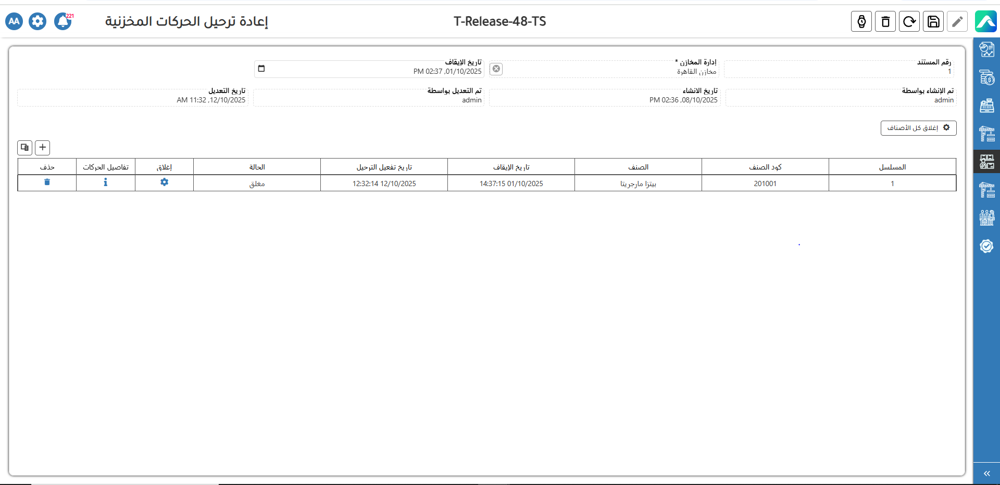

# إعادة ترحيل الحركات المخزنية

تعرض شاشة <strong>إعادة ترحيل الحركات المخزنية</strong> آلية دقيقة لإدارة عمليات إعادة الترحيل والتقييم ضمن النظام، وهي جزء أساسي من عملية <strong>احتساب التكلفة المتوسطة المرجحة</strong> في وحدة المخزون. عند تنفيذ عملية إعادة الترحيل، يتحقق النظام أولًا من وجود أي معاملات لم تُسجل في قائمة التكلفة، ويضمن عدم إغلاق الحسابات المالية الخاصة بالشركة قبل استيفاء الشروط اللازمة. بمجرد تحقق هذه المتطلبات، يقوم النظام تلقائيًا بحساب التكاليف وإنشاء القيود اليومية المطلوبة بشكل آلي، مما يضمن دقة البيانات المحاسبية واستمرارية تدفق العمليات المالية دون تدخل يدوي.

في بعض الحالات، قد يتم تفعيل <strong>إعادة التقييم</strong> عند إدخال معاملات بأثر رجعي، أي بتاريخ يسبق آخر تاريخ تم فيه احتساب التكلفة. في هذه الحالة، يسمح النظام بإدخال المعاملة دون حظرها، ثم يتحقق مما إذا كانت التكاليف السابقة قد تم احتسابها مسبقًا. إذا تبين وجود فروق في التكلفة، يقوم النظام بإنشاء قيود إعادة التقييم لتعديل قيمة المخزون وتحديث المعاملات المالية ذات الصلة. وإذا نتج عن هذه التعديلات أثر مالي، يتم تحديث دفتر الأستاذ العام وتعديل مستندات استلام أو إصدار البضائع بشكل متزامن.

كما يلتزم النظام بالسياسات المحاسبية من خلال قصر التسجيل على <strong>الفترات المالية المفتوحة فقط</strong>، ما يضمن الامتثال الكامل لمتطلبات الرقابة المالية. بالإضافة إلى ذلك، يظهر النظام <strong>تحذيرًا منبثقًا</strong> عند محاولة إدخال معاملة بتاريخ أقدم من آخر تاريخ للتكلفة، موضحًا تفاصيل العملية وتاريخها مقارنة بالتاريخ المرجعي للتكلفة، لتنبيه المستخدم قبل الحفظ.

وفي حال محاولة المستخدم <strong>إغلاق دورة التكلفة</strong> بينما لا تزال هناك معاملات معلقة، يعرض النظام رسالة تنبيه تمنع الإغلاق حتى يتم الانتهاء من جميع التعديلات المطلوبة. كما أن المعاملات التي يتم إدخالها بأثر رجعي تُعرض في وضع “عرض فقط”، أي لا يمكن تعديلها أو حذفها، لكنها تظل مرئية كمرجع ضمن عملية إعادة التقييم.

توضح الشاشة المرفقة مثالًا عمليًا على هذه العملية، حيث تُظهر تفاصيل المستند مثل رقم الحركة، وإدارة المخازن، وتاريخ الإيقاف وتاريخ إعادة التفعيل، إلى جانب حالة البند التي قد تكون “معلقة” حتى يتم إتمام عملية الترحيل بنجاح. هذه الواجهة تمنح المستخدم رؤية واضحة ودقيقة لجميع الحركات المخزنية، وتساعد على ضمان سلامة البيانات واستقرار عمليات المحاسبة والمخزون داخل النظام.

<figure><figcaption></figcaption></figure>

