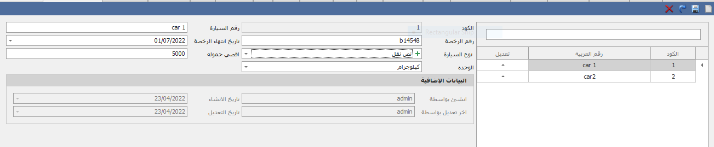

# Car Settings اعدادات السيارة

من خلال هذه الشاشة يتم انشاء السيارات لاستخدامها فى نقل البضائع واستخدامها فى شاشة  صرف البضاعة واستلام بضاعة وخطة التسليم&#x20;

-وفى شاشة اعدادات السيارة تستطيع ادخال رقم السيارة ورقم الرخصة وتاريخ انتهاء الرخصة

ونوع السيارة من خلال الضغط على علامه الموجب سيتم فتح ايقون يتم فيه ادخال اسم النوع وعمل حفظ وبعد ذلك يمكن اختيار هذا النوع لسيارة .ويمكن ادخال اقصى حموله لسيارة والوحده الخاصة بها&#x20;

