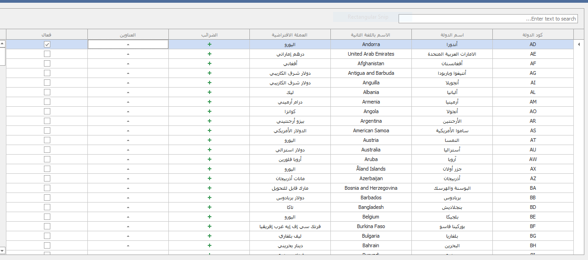
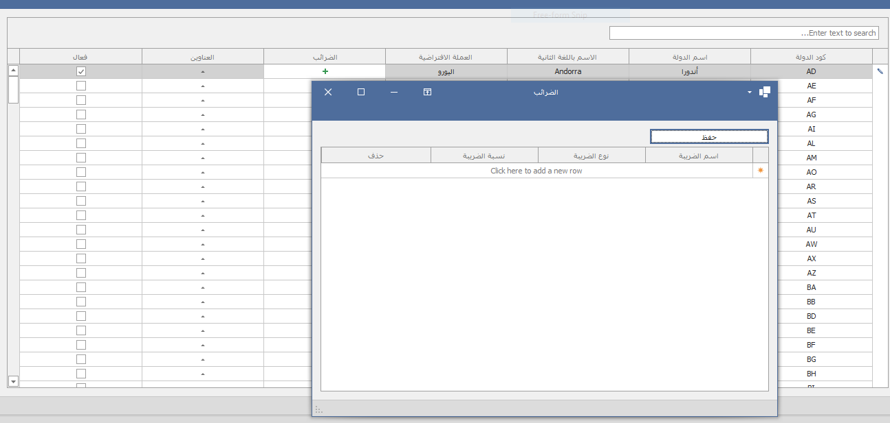
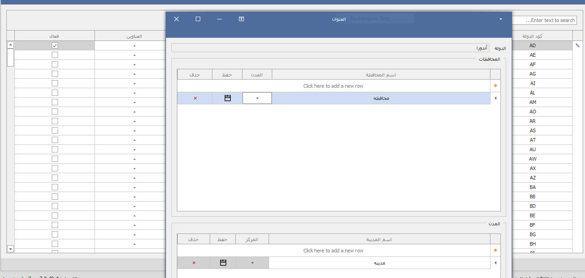

# الدول - Countries

يتم من خلالها تفعيل الدول التي يتم التعامل معاها و ربط الدول بالضرائب (ضريبة المنبع و القيمة المضافة) وايضا ادخال العناوين (من محافظات ومدن ومراكز) و عند انشاء عميل او مورد او مخزن يتم ريط المورد او العميل او المخزن بالدوله والاختيار من بين المحافظات والمدن والمراكز التى انشاءها مع هذه الدوله و يتم من خلالها معرفه الضرائب التي يجب التعامل بها مع هذا العميل او المورد &#x20;

&#x20;

