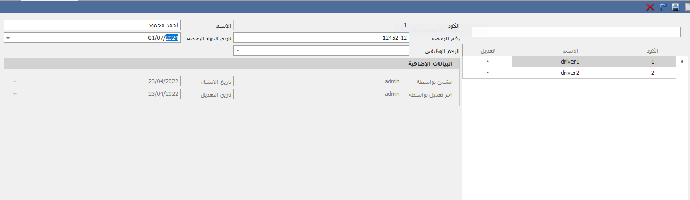

# اعدادات السائق-Driver Settings

من خلال هذه الشاشة يتم انشاء السائقين لاستخدامهم فى نقل البضائع وتطبيق عموله لهم وبيتم استخدامهم فى شاشة  صرف البضاعة واستلام بضاعة وخطة التسليم&#x20;

-وفى شاشة اعدادات السائق تستطيع ادخال اسم السائق ورقم الرخصة وتاريخ انتهاء الرخصة

واذا كان السائق موظف لدى فى الشركة ومتسجل فى برنامج شؤون الموظفين تستطيع ربط السائق برقم وظيفى&#x20;

