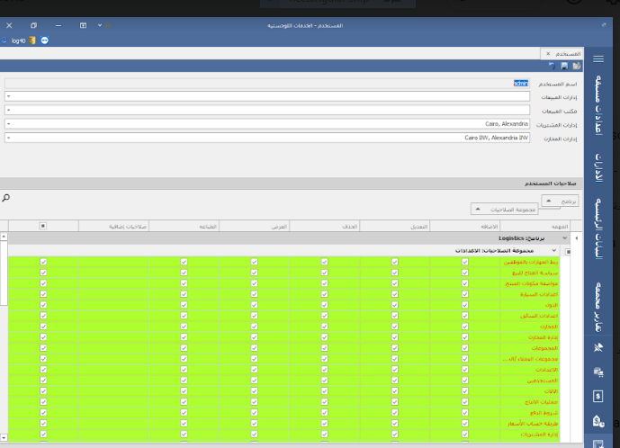

# المستخدمين و الصلاحيات-Users & Permissions

يتم من خلال شاشة المستخدمين والصلاحيات وتحديد صلاحية المستخدمين علي البرنامج، كما أنه يتم ربط المستخدم بالادارات التابع لها مثل ادارة المبيعات والمشتريات والمخازن، حتي يتم منع المستخدمين من عمل أي تغييرات أو إضافات لإدارات غير تابع لها.

مع العلم ان شاشة المستخدمين والصلاحيات لا تستخدم لإضافة المستخدمين الجدد، فالاضافة تتم من شاشة البرنامج الرئيسية Main Form كما هو موضح&#x20;

يتم فتح قسم الإعدادات في الشاشة الرئيسية ثم اختيار تابة المستخدمين ثم الضغط علي انشاء جديد ثم نقوم بإدخال البيانات مثل اسم المستخدم وكلمة المرور وباقي البيانات كما هو موضح، ويتم الضغط علي فعال حتي يكون حساب المستخدم فعالا ويستطيع استخدام البرامج

-فى شاشة الصلاحيات والمستخدمين بيظهر جميع الشاشات والتقارير الموجوده فى البرنامج ومن خلال هذه الشاشة يتم منح المستخدم صلاحيات على هذه الشاشات والتقارير على حسب صلاحية كل  مستخدم وطبيعة عملة  من اضافة وتعديل وحذف وعرض والطباعة&#x20;
