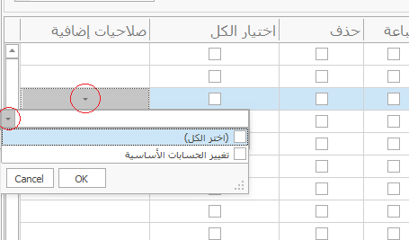

# المستخدمين

شاشة المستخدمين

تستخدم شاشة المستخدمين لإضافة مستخدمين والتعديل علي الصلاحيات الممنوحة للمتسخدم.

### إنشاء مستخدم جديد

لإنشاء مستخدم جديد يتم الضغط علي أيقومة الملف البيضاء.

سيتم تفعيل الخانات ليتم كتابة اسم المستخدم وكلمة السر الخاصة به ورقم الهاتف والعنوان، وتحديد إذا كان الحساب سيكون فعال ويعمل ام متوقف من check box فعال.

ويتم تحديد check box مستخدم رئيسي في حالة الحسابات الأهم وصاحبة المستوي الأعلي من الصلاحية مثل المدير.

وبالنسبة للمستخدمين الاخرين يتم تحديد الصلاحيات من جدول السماحيه، ويتم تحديد ال check box لإعطاء المستخدم الصلاحيه المتاحه.

لكل سماحيه خمسة أنواع من الصلاحيات وهم عرض وإضافة وتعديل وطباعة وحذف، وفي حالة الرغة في إعطار المستخدم كل صلاحيات السماحية يتم إختيار check box إختيار الكل.

###

ولاحظ أنه يوجد صلاحيات إضافية لبعض السماحيات الحساسة والمهمة ويتم إختيارها بطريقة مختلفة، يتم الضغط علي السهم لتفتح قائمة منسدلة ويتم تفعيل الصلاحية منها

### فائمة المستخدمين الحاليين

لفتح قائمة المستخدمين الحاليين يتم الضغط علي أيقونة الملف الصفراء من عناصر التحكم الرئيسية للشاشة.

تظهر قائمة بالمستخدمين الحاليين للسيستم وتظهر بعض البيانات التي تخص المستخدم، ولعرض كام البيانات والصلاحيات يتم تحديد المستخدم ثم الضغط علي زر اختر اسفل الشاشة، ليتم إظهار كامل البيانات للمستخدم مع إمكانية التعديل علي صلاحياته ثم الضغط علي حفظ.
