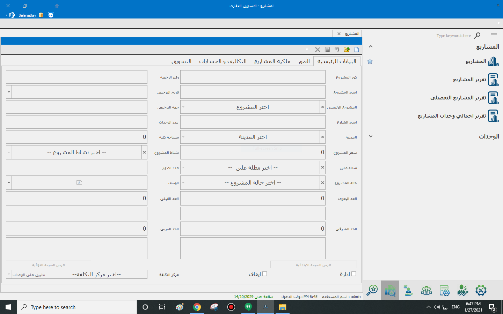

# المشاريع

المشاريع

يتم في شاشة المشاريع إضافة بيانات المشاريع بالتفاصيل كما يمكن إضافة معلومات إضافية مثل الصور، كما يتم إضافة نسب مليكة المشروع بالنسبة للمستثمرين. مع العلم أنه لا يتم الحفظ الا في حالة أن مجموع نسب المليكة تساوي 100%.

وعند الضغط علي التكاليف والحسابات يظهر معانا التكاليق والحسابات الضافة علي السيستم من [شاشة الإعدادات](https://docs.accflex.com/real-estate/alaadadat/basic_data)

كما أنه في حالة وجود تكلفة تسويق علي المشروع يتم إضافتها من تابة التسويق.

.PNG>)

