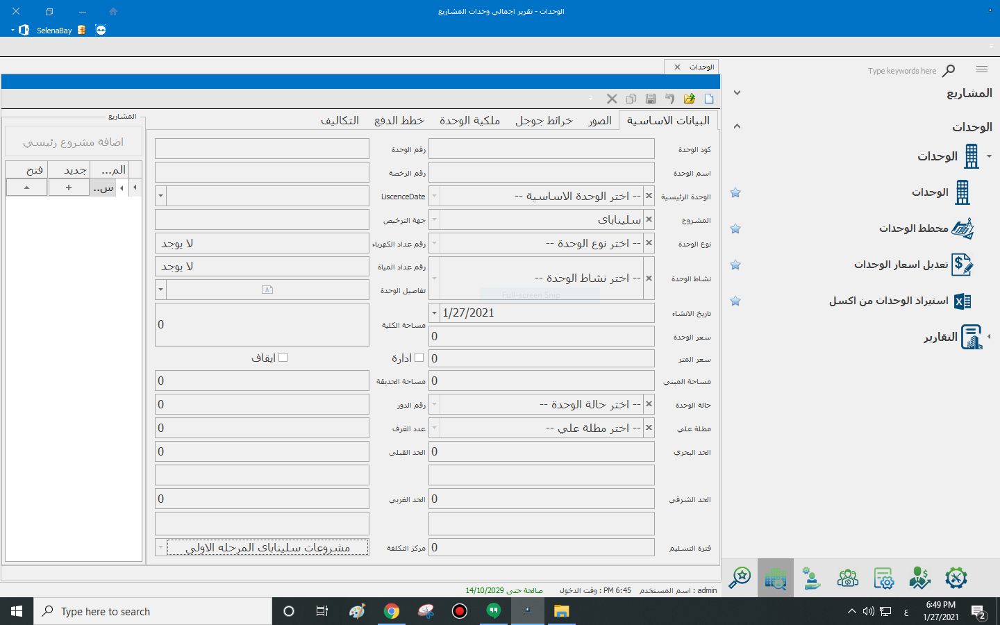

# الوحدات

**الوحدات**

يتم من خلال شاشة الوحدات اضافة الوحدات واضافة البيانات لها من خلال العديد من التابات التي تقسم المعلومات المهمة لاقسام مثل البيانات الاساسية اليت يتم فيها ذكر المعلومات الاساسة للوحدة وحالته والمشروع التابع له وتحديد اذا ما كانت ادارة ام لا، وايقاف التعامل علي الوحدة عن طريق وضع علامة علي ايقونة ايقاف

وفي تابة المرفقات يمكن اضاف المرفقات من خلال الصور واسم المرفق، ويتم اضافة الصورة من خلال اختيار الصورة اولا من زر الذي يوجد به ثلاث نقاط واختيار مسار الملف ثم الضغط علي زر اضافة واختيار صورة بشرط ان تكون الصورة بصيغة من الصيغات المدعومة مثل jpg, png  كما انه يمكن اضافة ملف بصيغى pdf&#x20;

وفي حالة ان الوحدة يوجد لها مستثمرين يتم ذكر حصة كل من الملاك في خلال شاشة ملكية الوحدة، فيتم اختيار اسم المستحدم المالك في خانة اسم المستخدم ويتم ذكر نسبة المليكة له كنسبة مئوية، وذكر اذا كان هذا الشخص هو ممثل الملكية ام لا، ويمكن في النهاية حذ المستخدم,

مع العلم ان الحفظ يتم بشكل تلقائي عند الضغط علي اي مكان.

ويتم اختيار خطة دفع مناسبة من الخطط التي تم اضافتها في العدادات وكتابة المبلغ الاضافي والنسبة ويتم الضغط بالموس في اي مكان ليتم حفظ الخطة.

.png>)

في الصورة التايه تتصح لنا تابة التكاليف والتي يتم فيه تفصيل التكاليف الخاصة بالوحده ويمكن للحساب أن يكون بالمتر عن طريق تشكاية، ويمكن أختيار كل الصفوف في مرة واحده عن طريق اختيار تحديد الكل.

في حالة انه يوجد ملحقات للوحدة فيتم اضافتها من تابة ملحقات الادارة ويتم ذكر اسمها وعددها والقيمة التقديرية وفي حالة انه يوجد اي ملاحظات عليها ويتم حفظ الملحقات بالضغط علي اي مكان فارغ.
