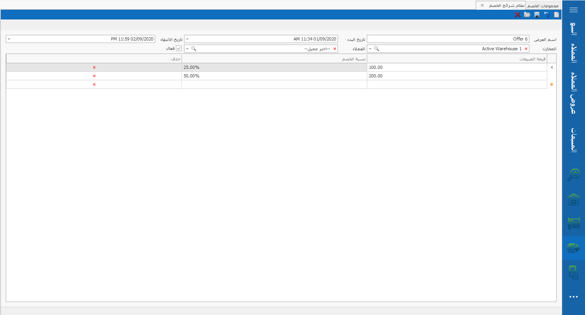

# نظام شرائح الخصم

## نظام شرائح الخصم 

.png>)

\
و من خلالها يتم إنشاء شرائح خصم و تطبيقها في فواتير البيع\
و يتم عمل شرائح خصم كالتالي :-

البيانات المطلوبة (\*)

-فتح عرض جديد \
-ادخال اسم العرض (\*)\
-ادخال تاريخ البدء و تاريخ الانتهاء\
-اختيار المخزن (\*)\
-اختيارالعميل (\*)\
-ادخال قيمة المبيعات (\*)\
-ادخال نسبة الخصم (\*)\
-الضغط على حفظ

