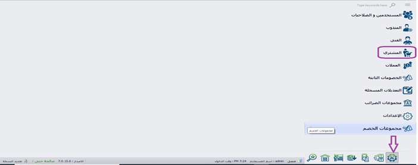

# المشترى

## المشترى 

**قد يرسل أحد الموردين بعد الموظفين لتتم عملية الشراء و بالتالى هؤلاء الموظفين ليس لديم بيانات مسجلة لدى الشركة ، و بما إنهم لا يعدوا موردين دائمين ، يتم تسجيل الاسم و رقم التليفون لهم كمرجع فقط.**

يتم إدخال البيانات بالشكل التالى : \
**مطلوب ادخاله (\*)**\
\
\- بعد اختيار الملحقات \
-نختار المشترى&#x20;

-فتح ورقة عمل جديدة (\*)\
\- كتابة الاسم (\*)\
-كتابة رقم التليفون (\*)\
-ثم حفظ (\*)

.PNG>)
