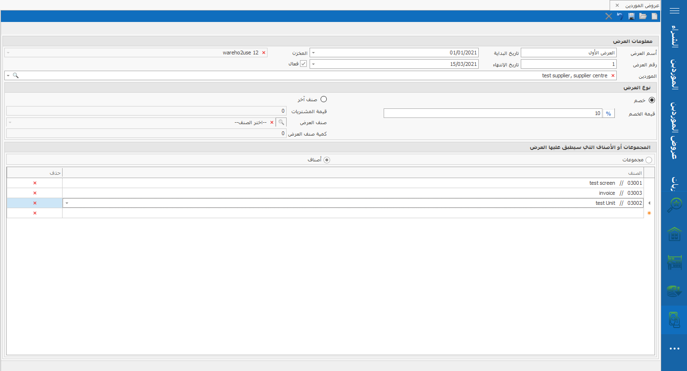

# عروض الموردين

## عروض الموردين 

**قد يحدد المورد عروض  على الأصناف أو المواد التى ستقوم الشركة بشرائها ، و بالتالى على الشركة تسجيل بيانات هذا العرض لديها لتطبيقه على فاتورة الشراء التى ستتم و يكون العرض إما بخصم قيمة على الفاتورة ككل أو بخصم على كمية معينة لصنف واحد أو  لمجموعة أصناف .**

.png>)

و يتم إنشاء عرض المورد بهذه الطريقة : \
\
**مطلوب إدخالها (\*)**\
\
\- يتم اختيارعروض الموردين&#x20;

-فتح ورقة جديدة (\*)\
\- ادخال اسم العرض (\*)\
\- ادخال رقم العرض\
&#x20;\- ادخال تاريخ بدء العرض\
\- ادخال تاريخ انتهاء العرض\
\- اختيار المخزن\
\- اختيارالمورد (\*)\
\- و الأهم تحديد ما إذا كان العرض فعال أو لا \
\- عند تحديد نوع العرض :\
\-  إما خصم و بالتالى سنحدد قيمة الخصم (\*)\
\- أو اختيار (صنف أخر) و فى هذه الحالة لابد من تحديد قيمة المشتريات (\*)\
&#x20;\- اسم الصنف (\*)\
&#x20;\- و كمية العرض لهذا الصنف (\*)\
\- ثم تحديد مجموعات أو أصناف ، و الاختيار أى منهما\
&#x20;\- ثم الضغط على حفظ (\*) 

تتتتتتتتتتتتتتتتتتتتتت
