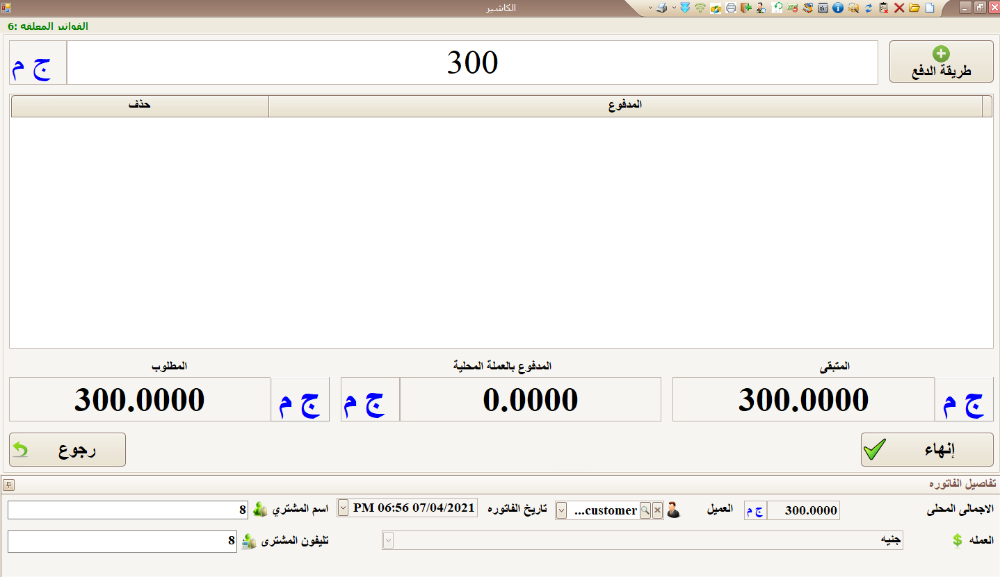

# فاتورة بيع

**لتطبيق سياسة نقاط العملاء يتم تحصيل فاتورة البيع من برنامج نقاط البيع (I Shop)** \
**حيث لابد من تحديد اسم المشترى  أو رقم هاتفه .**

**البيانات المطلوبة (\*)**

-اختيار المخزن (\*)\
\- اختيار المندوب (\*)\
-اختيار الصنف (\*)\
\- ادخال كمية الصنف (\*)\
-ادخال تليفون المشترى (\*)\
-اختيار العميل(\*)\
-ادخال اسم المشترى (\*)\
\- الضغط على "كاش" (\*)\
\- ادخال قيمة الفاتورة (\*)\
\- ثم الصغط على إنهاء (\*)

.png>)

 

