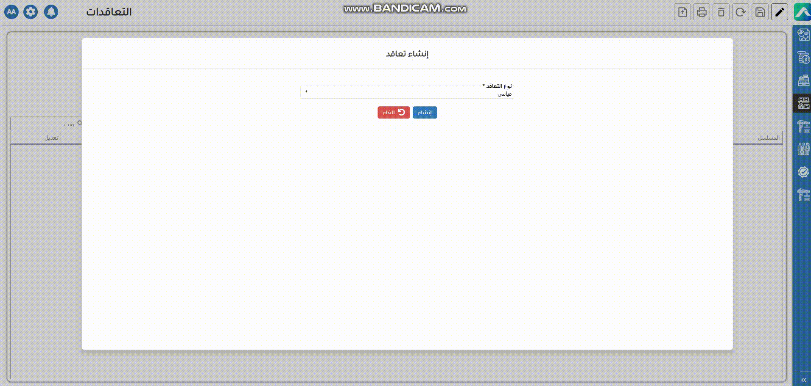

# المبيعات

### المبيعات

<figure><figcaption></figcaption></figure>

في مجال صناعة الخرسانة، تبدأ عملية البيع حتى قبل صب الخرسانة. غالبًا ما تنطلق من طلب عرض سعر مبيعات حيث يتواصل العميل مع الشركة للاستفسار عن الأسعار، مدى التوفر، أو أنواع الخلطات الخرسانية المتاحة. تُعد هذه المرحلة التمهيدية خطوة أساسية لفهم احتياجات العميل وتقديم عرض يناسب متطلباته من حيث الجودة والكمية والتوقيت.

<figure><figcaption>
طلب عرض سعر مبيعات
</figcaption></figure>

 <strong>تسجيل عروض الأسعار:</strong> بناءً على طلب البيع، تقوم الشركة بإعداد وإرسال عرض أسعار رسمي إلى العميل. يتضمن العرض تفاصيل واضحة مثل السعر، و أسعار الخلط و التوصيل، شروط وأوقات التسليم . يهدف هذا الإجراء إلى توثيق شروط الاتفاق وضمان وضوح التفاهم بين الطرفين قبل المضي قدمًا في عملية البيع.

<figure><figcaption>
تسجيل عروض أسعار
</figcaption></figure>

يتضمن عقد البيع معلومات أساسية تُعد ضرورية لتنفيذ الطلب بدقة، مثل اسم العميل، وبيانات الشخص المسؤول عن التواصل، ومعلومات الاتصال، إلى جانب عناوين الفوترة والتسليم، وأي أرقام ضريبية أو بيانات تسجيل ذات صلة. يتم إدخال هذه البيانات أو اختيارها من النظام في بداية دورة المبيعات، وغالبًا ما يتم ذلك عند إنشاء استفسار أو تقديم عرض أسعار، لضمان سير العملية بسلاسة ووفق المتطلبات القانونية والإدارية.

<figure><figcaption>
التغاقدات
</figcaption></figure>

يمكن إنشاء طلب البيع إما بشكل مباشر أو بالاستناد إلى طلب عرض سعر سابق. من خلال شاشة طلب عرض سعر مبيعات يمكن إدخال سعر الوحدة يدويًا، بالإضافة إلى إضافة أي خدمات مرتبطة مثل خلط الخرسانة وخدمة التوصيل. تُنقل هذه الخدمات تلقائيًا إلى شاشة توصيل الخلطة الجاهزة أثناء تنفيذ عملية التسليم.

لضمان حفظ طلب البيع بشكل صحيح، هناك مجموعة من الحقول الإلزامية التي يجب تعبئتها، مثل نوع الطلب، إدارة المبيعات، اسم العميل، تاريخ الطلب، ومعلومات إدارة المخزون. تساعد هذه البيانات في ضمان معالجة الطلب بدقة، وتكامل العملية مع المراحل التالية، مع تمكين التتبع السليم لكل ما يتعلق بالمخزون والتسليم.

<figure><figcaption>
أمر بيع
</figcaption></figure>

في صناعة الخرسانة الجاهزة، يتم إصدار الفواتير يدويًا بعد استلام العميل للتسليم.

<figure><figcaption>
فاتورة بيع
</figcaption></figure>

يمكن للعميل الدفع عن طريق البنك أو نقدا حسب الاتفاق في العقد.

<figure><figcaption>
المقبوضات
</figcaption></figure>

القيود اليومية:

<table data-header-hidden><thead><tr><th valign="top"></th><th valign="top"></th><th valign="top"></th></tr></thead><tbody><tr><td valign="top">شرح</td><td valign="top">مدين</td><td valign="top">دائن</td></tr><tr><td valign="top">       العميل</td><td valign="top">×××××××</td><td valign="top"> </td></tr><tr><td valign="top">إيرادات</td><td valign="top"> </td><td valign="top">×××××××</td></tr></tbody></table>

&#x20;

<table data-header-hidden><thead><tr><th valign="top"></th><th valign="top"></th><th valign="top"></th></tr></thead><tbody><tr><td valign="top">شرح</td><td valign="top">مدين</td><td valign="top">دائن</td></tr><tr><td valign="top">بنك/ نقدي</td><td valign="top">××××</td><td valign="top"> </td></tr><tr><td valign="top">العميل</td><td valign="top"> </td><td valign="top">×××××</td></tr></tbody></table>

&#x20;
