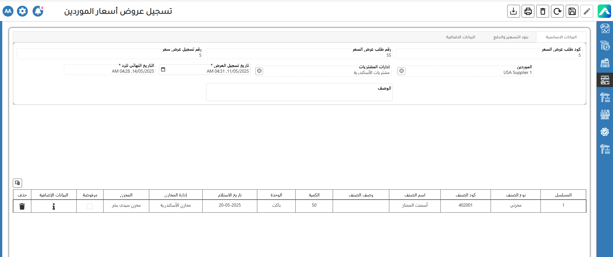
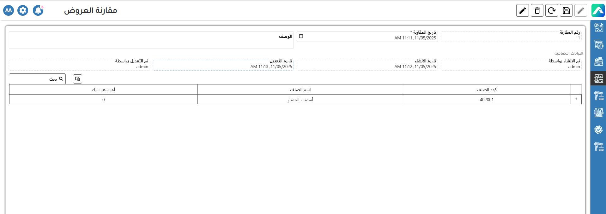

# المشتريات و المخازن




<strong>المشتريات</strong> 

<figure><figcaption></figcaption></figure>

 تبدأ عملية الشراء عندما تحدد الشركة حاجتها إلى مواد محددة، مثل الأسمنت أو الرمل أو المواد الكيميائية المستخدمة في إنتاج الخلطات الجاهزة. بعد ذلك، يتم إصدار طلب شراء، وهو مستند داخلي تقدمه الإدارة لطلب عناصر محددة. يهدف هذا الإجراء إلى ضمان مراجعة جميع المشتريات والتأكد من توافقها مع الميزانية والاحتياجات التشغيلية.

<figure><figcaption>
طلب الشراء
</figcaption></figure>

قبل التعاقد مع أي مورد، تسعى الشركة عادةً للحصول على أفضل عرض ممكن من حيث السعر والشروط. تقوم إدارة المشتريات بإرسال طلبات عروض أسعار إلى عدة موردين، حيث يقدم كل مورد تفاصيل تتضمن الأسعار، ومواعيد التسليم، والشروط الخاصة به. يتيح لك نظام AccFlex إدخال جميع هذه العروض ضمن النظام، وإدارتها من خلال مرحلة "طلب عرض سعر". بعد ذلك، يمكن مقارنة العروض وتقييمها بناءً على السعر، وتوفر المواد، والشروط التعاقدية. تساهم هذه العملية في اتخاذ قرارات شراء مدروسة ومبنية على اعتبارات اقتصادية واضحة.

<figure><figcaption>
طلب عرض سعر
</figcaption></figure>

<figure><figcaption>
تسجيل عروض أسعار الموردين
</figcaption></figure>

<figure><figcaption>
مقارنة العروض
</figcaption></figure>

بعد اختيار المورد المناسب، تكون الخطوة التالية هي اعتماد الطلب وإصدار أمر الشراء. يُعد أمر الشراء بمثابة اتفاق رسمي بين الشركة والمورد، ويتضمن تفاصيل دقيقة مثل الكميات المطلوبة، أسعار الوحدات، جداول التسليم، شروط الدفع، وأي بنود أخرى تم الاتفاق عليها. في نظام AccFlex ERP، يتم ربط أمر الشراء مباشرةً مع نظام المورد والمخازن، مما يتيح لاحقًا مطابقة الطلب مع البضائع المستلمة فعليًا ومع فاتورة المورد، لضمان دقة العمليات وسهولة تتبعها.  

<figure><figcaption>
أمر التوريد
</figcaption></figure>

بمجرد استلام البضائع وتسجيلها في النظام من خلال إشعار استلام البضائع (GR/ IR)، يرسل المورد فاتورة للمواد التي تم تسليمها.

<figure><figcaption>
مطابقة الفاتورة
</figcaption></figure>

ثم يمكن إجراء الدفع إما عبر البنك أو نقدًا.

<figure><figcaption></figcaption></figure>

 القيود اليومية

<table data-header-hidden><thead><tr><th valign="top"></th><th valign="top"></th><th valign="top"></th></tr></thead><tbody><tr><td valign="top">الشرح</td><td valign="top">مدين</td><td valign="top">دائن</td></tr><tr><td valign="top">الأصناف خام</td><td valign="top">×××</td><td valign="top"> </td></tr><tr><td valign="top">                              GR/IR</td><td valign="top"> </td><td valign="top">×××</td></tr></tbody></table>

&#x20;

<table data-header-hidden><thead><tr><th valign="top"></th><th valign="top"></th><th valign="top"></th></tr></thead><tbody><tr><td valign="top">الشرح</td><td valign="top">           مدين        </td><td valign="top">دائن</td></tr><tr><td valign="top">GR/IR</td><td valign="top">×××</td><td valign="top"> </td></tr><tr><td valign="top">ضريبة القيمة المضافة</td><td valign="top">××</td><td valign="top"> </td></tr><tr><td valign="top">ضريبة من المنبع</td><td valign="top"> </td><td valign="top">×</td></tr><tr><td valign="top">المورد</td><td valign="top"> </td><td valign="top">×××</td></tr></tbody></table>

 عملية الدفع

<table data-header-hidden><thead><tr><th valign="top"></th><th valign="top"></th><th valign="top"></th></tr></thead><tbody><tr><td valign="top">الشرح</td><td valign="top">مدين</td><td valign="top">دائن</td></tr><tr><td valign="top">المورد</td><td valign="top">×××××</td><td valign="top"> </td></tr><tr><td valign="top">نقدي/ بنك</td><td valign="top"> </td><td valign="top">××××</td></tr></tbody></table>

&#x20;

 



### المخازن

تُعد هذه المرحلة جزءًا بالغ الأهمية في سير العمل، حيث إن إدارة حركة المواد الخام — مثل الرمل، الحصى، الأسمنت، الماء، والإضافات — داخل المخازن وخارجها تؤثر بشكل مباشر على دقة المخزون والتحكم في التكاليف.

  استلام البضاعة في نظام AccFlex ERP، تُسجل حركة استلام المواد من خلال إشعار استلام البضائع (GR/IR)، وهو مستند يُوثّق الأصناف المستلمة فعليًا، والكميات، والمخزن الذي استُلمت فيه، مع ربطها مباشرة بأمر الشراء. عند تسجيل الاستلام، يتم تحديث المخزون تلقائيًا لتعكس الكميات الجديدة، مما يضمن دقة بيانات المخزون ويعزز الرقابة على العمليات الشرائية والتخزينية.

<figure><figcaption>
استلام بضاعة
</figcaption></figure>

صرف بضاعة

تعمل شاشة إصدار البضائع في نظام AccFlex ERP على تسجيل حركة المخزون تلقائيًا بمجرد تغيير حالة شاشة تسليم الخرسانة الجاهزة إلى "جاري التسليم". هذا يعني أنه عند مغادرة شاحنة التوصيل للمصنع، يقوم النظام تلقائيًا بخصم الكميات المستخدمة من المواد الخام في المخزون، وتسجيلها كعملية إصدار بضائع مرتبطة بخطة التوصيل. يضمن هذا الإجراء تتبعًا دقيقًا وآنيًا لحركة المخزون، مما يعزز الرقابة على المواد ويُسهِم في تحسين إدارة التكاليف.

<figure><figcaption>
صرف بضاعة
</figcaption></figure>

القيود اليومية

استلام مواد الخام

<table data-header-hidden><thead><tr><th valign="top"></th><th valign="top"></th><th valign="top"></th></tr></thead><tbody><tr><td valign="top">الشرح</td><td valign="top">مدين</td><td valign="top">دائن</td></tr><tr><td valign="top">مواد الخام</td><td valign="top">××</td><td valign="top"> </td></tr><tr><td valign="top">GR/  IR</td><td valign="top"> </td><td valign="top">××</td></tr></tbody></table>

صرف مواد الخام

<table data-header-hidden><thead><tr><th valign="top"></th><th valign="top"></th><th valign="top"></th></tr></thead><tbody><tr><td valign="top">Description</td><td valign="top">Debit</td><td valign="top">Credit</td></tr><tr><td valign="top">إنتاج تحت التصنيغ</td><td valign="top">××</td><td valign="top"> </td></tr><tr><td valign="top">مواد الخام</td><td valign="top"> </td><td valign="top">××</td></tr></tbody></table>



